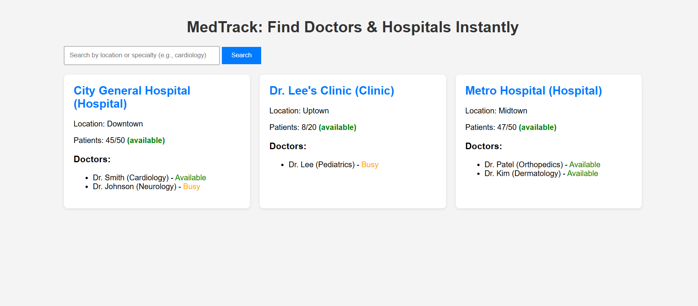

# 🏥 MedTrack - Real-Time Healthcare Access

**MedTrack** is a real-time healthcare dashboard that helps users find hospitals and doctors instantly.  
It updates every 10 seconds to simulate real-time capacity and availability changes.

## 🚀 Features
- Real-time updates every 10 seconds
- Search by location or specialty
- Dynamic hospital load tracking
- Color-coded doctor availability
- Fully responsive design

## 🖥️ Preview


## ⚙️ How to Run Locally
1. Clone this repository:
   ```bash
   git clone https://github.com/<your-username>/MedTrack-Dashboard.git
